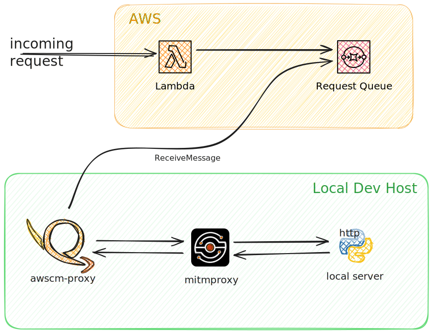

How it Works
=============

It is very simple.  When first invoked, awscm-proxy creates AWS serverless
resources to receive and enqueue external requests.  To proxy these
requests, it waits for messages in the queue and forwards them to the
appropriate local endpoint.

A picture is worth a thousand words.

Unidirectional Proxy
----------------------

The default proxy mode is unidirectional: a fixed 200 response is returned 
when incoming requests are queued, and the local response is ignored.

This is accomplished using AWS API Gateway and an SQS Queue.

Bidirectional Proxy
----------------------

In bidirectional mode, the request handler waits for 25 seconds
to get a response from the local and forward it back to the requester.

.. figure:: images/bidirectional-proxy.svg
   :alt: Bidirectional proxy architecture

This is accomplished using a lambda, a state machine, and a queue.
The lambda polls for a response, and the state machine simplifies
the problem of associating a response with the original request.
